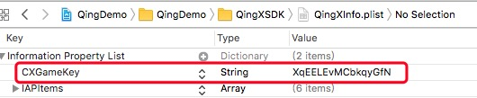

# 畅想互动iOS接入文档 v0.2.1-180529#

## 重要提醒 ##
* **SDK有使用到IDFA，提交苹果审核时注意勾选，参考下图：**


* **Xcode工程需关闭 Bitcode，本 SDK 支持 iOS8 及以上版本，兼容横竖屏；支持 arm64 armv7 armv7s**
	
* **SDK默认开启自动登录功能，不能关闭；用户要切换账号需登陆成功后点击切换**

* **<font color=red>请务必先调用初始化后，再调用其他接口</font>**


</br>

## SDK接入说明 ##
* **获取参数
从后台获取以下参数，用于工程配置及代码接入**


参数名 | 类型 | 说明   
:------- |:------- | :-----------
CXGameKey | string | 我方提供的gamekey


</br>

* **将SDK加入(拖入)工程：**

* QingXUtil.framework


* QingXInfo.plist


<font color=red>**注意查看Framework搜索路径是否包含SDK所在目录**</font>

</br>

* **Target->General->Embedded Binaries里添加QingXUtil.framework**


* <font color=red>**在QingXInfo.plist添加CXGameKey，值为我方提供的gamekey【重要】</font>**
* <font color=red>**在QingXInfo.plist添加CXGameKey，值为我方提供的gamekey【重要】</font>**




添加相册权限

```

	<key>NSPhotoLibraryAddUsageDescription</key>
	<string>访问相册以保存账号信息截图</string>
	<key>NSPhotoLibraryUsageDescription</key>
	<string>访问相册以保存账号信息截图</string>
	
```

</br>

* **初始化，在合AppDelegate.m引入头文件， 初始化SDK【重要】**


```
#import "QingXUtil/QingXUtil.h"

- (BOOL)application:(UIApplication *)application didFinishLaunchingWithOptions:(NSDictionary *)launchOptions {
    [QingXUtil application:application didFinishLaunchingWithOptions:launchOptions];
    return YES;
}
```


</br>

* **设置登出回调，玩家在自动登录成功后点击“切换账号”按钮，或者在CP调用logout接口后，都会回调本回调。是否设置登出回调，CP自行斟酌，建议CP在初始化之后或登录前设置好**		

```
// 设置登出回调
[QingXUtil xSetLogoutBlock:^(QingX_UserInfo *info){
        NSLog(@"did logout %@",info);
        NSString *uid = [info qingx_user_id];
        NSString *utoken = [info qingx_user_token];
    }];
```
			
</br>

* **登录【重要】**

```
[QingXUtil xShowLoginWithBlock:^(QingX_UserInfo *info){
        NSLog(@"did login %@",info);
        NSString *uid = [info qingx_user_id];
        NSString *token = [info qingx_user_token];
    }];
``` 	
回调QingX_UserInfo，参数见下面

QingX_UserInfo字段 | 类型 | 说明   
:------- |:------- | :-----------
qingx\_user\_id | NSString | 玩家唯一标识
qingx\_user\_token | NSString | 登录票据

**若已登陆过，下次启动SDK将会自动登录，玩家要切换账号的话需自动登录成功后点击“切换账号”进行切换**

</br>

* **登出**
 		
```
[QingXUtil xLogout];
```
			
</br>


* **支付【重要】**

```
QingX_OrderParams *params = [QingX_OrderParams new];
params.qingx_product_name = @"test_product";        // 商品名
params.qingx_product_id = @"cx-6";                  // 商品ID（运营提供）
params.qingx_product_price = 600;                   // 价格 单位:分
params.qingx_cp_order_id = @"test_order_ID";        // cp订单号
params.qingx_role_id = @"role1";                    // 角色id
params.qingx_role_name = @"role1";                  // 角色名
params.qingx_server_id = @"1";                      // 区服id
params.qingx_server_name = @"server1";              // 区服名
params.qingx_role_vip = @"1";                       // vip等级
params.qingx_role_level = @"100";                   // 角色等级
params.qingx_extends_param1 = @"extends_param1";    // 扩展透传参数1
params.qingx_extends_param2 = @"extends_param2";    // 扩展透传参数2
    
[QingXUtil xRequestOrderWithParams:params withBlock:^(QingX_OrderResult *info){    
    NSLog(@"did pay %@",info);
    NSString *orderID = [info qingx_order_id];
    NSString *cpOrderID = [info qingx_cp_order_id];
    BOOL result = [info qingx_result];
    NSString *message = [info qingx_message];
}];                                                 // 拉起支付

```
QingX_OrderParams字段 | 类型 | 必需 | 说明   
:------- |:-------|:------- | :-----------
qingx\_product\_name | NSString | 是 | 商品名
qingx\_product\_id | NSString | 是 | 商品ID（运营提供）
qingx\_product\_price | int | 是| 商品价格，<font color=red>单位：分</font>
qingx\_cp\_order\_id | NSString | 是| CP订单号
qingx\_role\_id | NSString | 是| 角色id
qingx\_role\_name | NSString | 是| CP订单号
qingx\_server\_id | NSString | 是| 角色名
qingx\_server\_name | NSString | 是| 区服id
qingx\_role\_vip | NSString | 是| vip等级
qingx\_role\_level | NSString | 是| 角色等级
qingx\_extends\_param1 | NSString| 否 | 扩展透传参数1（CP用）
qingx\_extends\_param2 | NSString | 否| 扩展透传参数2（CP用）

**<font color=red>使用IAP支付时，如果不传商品ID，或者商品ID没传对，会按价格匹配IAP计费点进行支付</font>**

支付回调QingX_OrderResult见下表
	
QingOrderResult字段 | 类型 | 说明
:------- |:------- | :-----------
qingx\_order\_id | NSString | 平台订单号
qingx\_cp\_order\_id | NSString | CP订单号
qingx\_result | BOOL | 支付结果，是否成功
qingx_message | NSString | 支付结果信息
<font color=gray>qing\_state</font> | <font color=gray>int</font> | <font color=gray>支付状态，已弃用</font>


</br>

* **接入application系列接口【重要】**

```
- (BOOL)application:(UIApplication *)application openURL:(NSURL *)url sourceApplication:(NSString *)sourceApplication annotation:(id)annotation
{
    [QingXUtil application:application openURL:url sourceApplication:sourceApplication annotation:annotation];    
    return YES;
}

- (BOOL)application:(UIApplication *)application handleOpenURL:(NSURL *)url {
    [QingXUtil application:application openURL:url sourceApplication:nil annotation:nil];    
    return YES;
}

- (BOOL)application:(UIApplication *)app openURL:(NSURL *)url options:(NSDictionary<UIApplicationOpenURLOptionsKey, id> *)options
{
    [QingXUtil application:app openURL:url sourceApplication:nil annotation:nil];
    return YES;
}

- (void)applicationWillResignActive:(UIApplication *)application {
    [QingXUtil applicationWillResignActive:application];
}

- (void)applicationDidEnterBackground:(UIApplication *)application {
    [QingXUtil applicationDidEnterBackground:application];
}

- (void)applicationWillEnterForeground:(UIApplication *)application {
    [QingXUtil applicationWillEnterForeground:application];
}

- (void)applicationDidBecomeActive:(UIApplication *)application {
    [QingXUtil applicationDidBecomeActive:application];
}

- (void)applicationWillTerminate:(UIApplication *)application {
    [QingXUtil applicationWillTerminate:application];
}
```

	
</br>

* **关闭工程 Bitcode（ TARGETS -> Build Settings -> Build Options -> Enable Bitcode 设置为 NO）**


	

	
</br>


## 常见错误处理 ##

* 崩溃相关image not found


	
解决方法：**General->embedded binaries里添加QingXUtil.framework**

</br>

* 初始化失败


	
解决方法：**QingXInfo.plist里添加键值CXGameKey，值为我方提供的gamekey**

</br>

* iOS version相关


	
解决方法：**SDK最低支持iOS8，若项目需要更低版本，请联系技术支持**

</br>

* Bitcode没关


	
解决方法：**TARGETS -> Build Settings -> Build Options -> Enable Bitcode 设置为 NO**

</br>
	
* 架构相关


	
解决方法：**SDK不支持模拟器编译，只能真机运行，若真的需要在模拟器中运行，请联系技术支持**

</br>

* IAP相关


	
解决方法：**检查计费点配置及报名是否正确**

</br>

* 系统异常


解决方法：**SDK初始化失败或在初始化前调用了其他接口，请查确保在其他调用前先执行初始化**