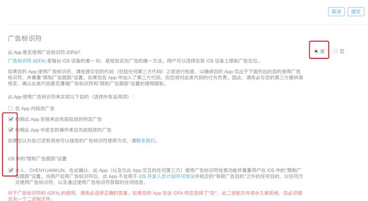
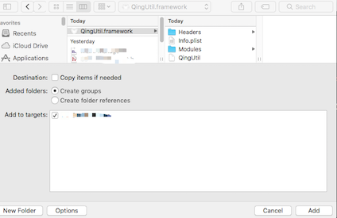
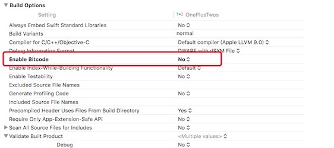
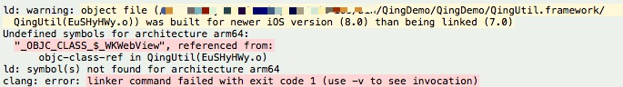
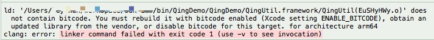
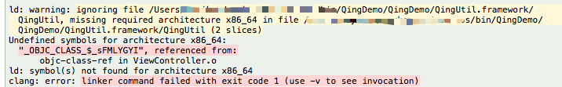
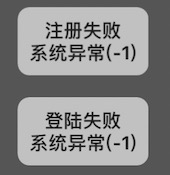

=畅想互动iOS接入文档
##重要提醒
* **SDK有使用到IDFA，提交苹果审核时注意勾选，参考下图：**



* **Xcode工程需关闭 Bitcode，本 SDK 支持 iOS8 及以上版本，兼容横竖屏；支持 arm64 armv7 armv7s**
	
* **SDK默认开启自动登录功能，不能关闭；用户要切换账号需登陆成功后点击切换**

</br>

##SDK接入说明
* **获取参数
从后台获取以下参数，用于工程配置及代码接入**


参数名 | 类型 | 说明   
:------- |:------- | :-----------
game_key | string | 后台分配的每个游戏的唯一标识串


</br>

* **将SDK加入(拖入)工程：**



</br>

* **关闭工程 Bitcode（ TARGETS -> Build Settings -> Build Options -> Enable Bitcode 设置为 NO）**


	

	
</br>

* **初始化，在合适的地方引入头文件，用 game_key 初始化 SDK**


```
#import "QingUtil/QingUtil.h"

[QingApi initWithGameKey:@"xxxxxxxx"]   // 替换成game_key
```
参数名 | 类型 | 说明   
:------- |:------- | :-----------
game_key | NSString* | game_key

		
			
</br>

* **登录**

```
[QingApi qingRequestOrderParams:params withBlock:^(QingOrderResult *info){        
        	NSLog(@"did pay %@",info);
}];
``` 	
登录回调QingOrderResult，参数见下面

QingUserInfo字段 | 类型 | 说明   
:------- |:------- | :-----------
qing\_user\_id | NSString | 玩家唯一标识
qing\_user\_token | NSString | 登录票据

**若已登陆过，下次启动SDK将会自动登录，玩家要切换账号的话需自动登录成功后点击“切换账号”进行切换**
	
</br>

* **登出**
 		
```
[QingApi qingLogout];
```
			
</br>


* **支付，支付前请先查询SDK支付是否可用，若不可用，则走CP自己的IAP支付**

```
[QingApi qingIsPaymentUsable];  // 返回YES则可用， NO则不可用
```
		
* **拉起支付**

```
QingOrderParams *params = [[QingOrderParams alloc] init];
params.qing_product_name = @"test_product";        // 商品名
params.qing_product_price = 1;                     // 价格 单位:分
params.qing_cp_order_id = @"test_order_ID";        // cp订单号
params.qing_is_sandbox = NO;                       // 是否沙盒
params.qing_extends_param1 = @"extends_param1";    // 扩展参数1
params.qing_extends_param2 = @"extends_param2";    // 扩展参数2
 
[QingApi qingRequestOrderInfo:params withBlock:^(QingOrderResult *info){
	NSLog(@"did pay %@",info);
}];                                                // 拉起支付

```
QingOrderParams字段 | 类型 | 说明   
:------- |:------- | :-----------
qing\_product\_name | NSString | 商品名
qing\_product\_price | int | 商品价格，单位：分(RMB)
qing\_cp\_order\_id | NSString | CP订单号
qing\_is\_sandbox | BOOL | 是否沙盒 1为是，0为否
qing\_extends\_param1 | NSString | 扩展参数1（CP用）
qing\_extends\_param2 | NSString | 扩展参数2（CP用）

支付回调resultInfo见下表
	
QingOrderResult字段 | 类型 | 说明
:------- |:------- | :-----------
qing\_order\_id | NSString | 平台订单号
qing\_cp\_order\_id | NSString | CP订单号
qing\_state | int | 支付结果，大于2为支付成功
qing_message | NSString | 支付结果信息


	
</br>


## 常见错误处理

* iOS version相关


	
解决方法：**SDK最低支持iOS8，若项目需要更低版本，请联系技术支持**

</br>

* Bitcode没关


	
解决方法：**TARGETS -> Build Settings -> Build Options -> Enable Bitcode 设置为 NO**

</br>
	
* 架构相关


	
解决方法：**SDK不支持模拟器编译，只能真机运行，若真的需要在模拟器中运行，请联系技术支持**

</br>

* 系统异常



解决方法：**SDK初始化失败或在初始化前调用了其他接口，请查看初始化game_key是否正确，且确保在其他调用前执行初始化**